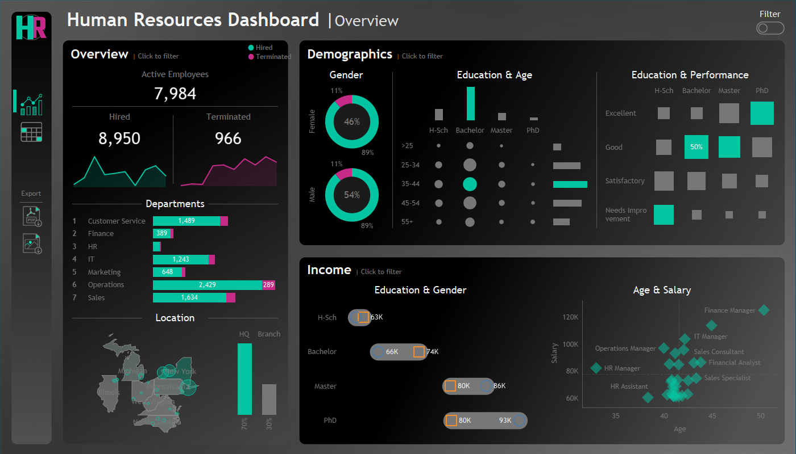
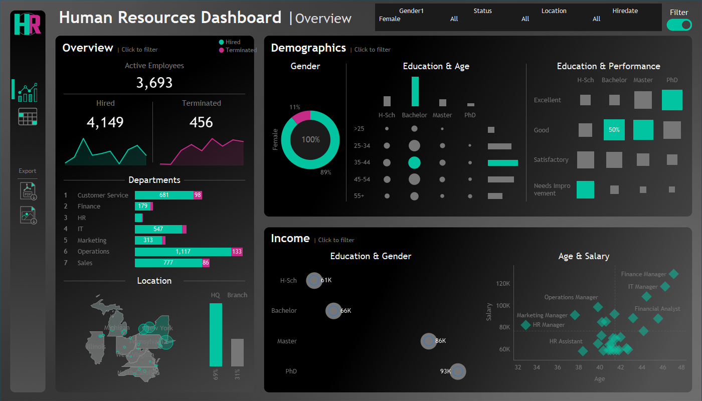
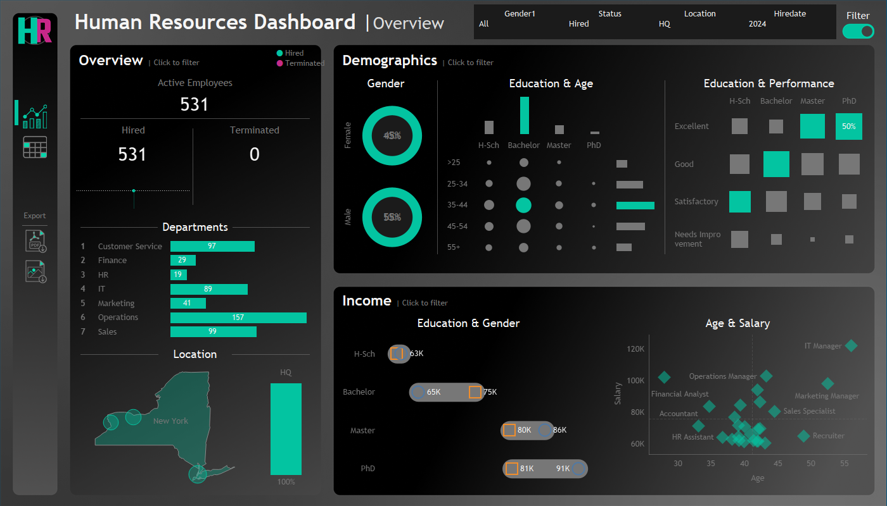

# HR Dashboard 📊

A sleek, interactive Human Resources dashboard built with Tableau to visualize workforce metrics across departments, demographics, locations, and more.

---

## 🗂️ Repository Structure

```
D:.
├── Dashboard/         # Tableau workbook(s) (.twb or .twbx) and supporting files
├── Data/              # CSV / Excel source datasets
└── Screenshots/       # PNGs of dashboard views
```

---

## 🚀 Project Overview

This dashboard provides HR teams with at-a-glance insights into:

* **Workforce Headcount** – Active, hired vs. terminated over time
* **Department Breakdown** – Staffing levels by department
* **Demographics** – Gender, age & education distributions
* **Performance vs. Education** – Heatmap of performance ratings by degree
* **Compensation Analysis** – Income by education, age & role
* **Employee Details** – Table view of individual records with filters

<p align="center">
  
</p>

---

## 📈 Key Features

* **Dynamic Filters** for gender, status, location, hire date, etc.
* **Interactive Tooltips** to drill-down on any chart element
* **Map Visualization** of office & branch locations
* **Custom Calculations** for tenure, percentiles, and growth rates
* **Export-ready**: printable PDF or image exports

---

## 🛠️ Getting Started

1. **Clone this repository**

   ```bash
   git clone https://github.com/<your-username>/HRDashboard-Tableau.git
   cd HRDashboard-Tableau
   ```

2. **Open the Dashboard**

   * Launch Tableau Desktop (v2021.1 or later)
   * Open `Dashboard/HR_Dashboard.twbx`

3. **Connect to Data**

   * In Tableau’s Data pane, point the data source to the files in `Data/`
   * Refresh extract or live-connection as needed

4. **Publish or Export**

   * To Tableau Server/Public: File → Publish to Server
   * To PDF: File → Export → PDF


---

## 📝 Screenshots

|                            Overview                            |                            Demographics                            |                            Filtered                           |                            Details                            |
| :------------------------------------------------------------: | :----------------------------------------------------------------: | :----------------------------------------------------------: | :-----------------------------------------------------------: |
|  |  |  |  |

---

